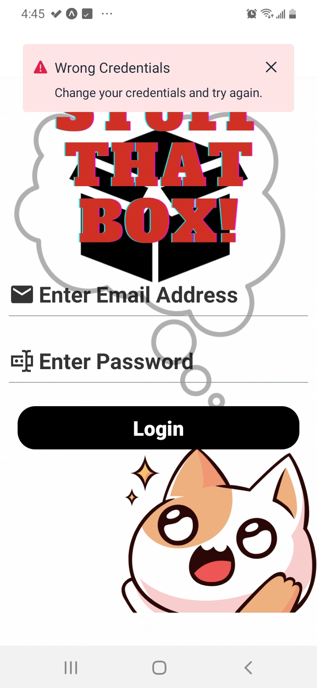

## **Hello I'm George**

As a freelance software developer, some of the qualities that describe me best are my creative problem-solving skills, the ability to think outside of the box, and being a quick and eager learner of programming languages and frameworks. My peers have often described me as a communication-oriented and proactive colleague whose opinion they strongly value.

A proud achievement of mine is the 'e-orders' ordering system that I developed. It uses the Flask web Framework as a back-end along with React Native for the mobile app, serving the local hospitality businesses in my hometown. 

## Skills and Experience

- Flask
- React Native
- HTML, CSS, JS

# Mobile Apps

- [Stuff in a box](#stuff-in-a-box)
- [e-orders](#e-orders)
- [epoptis](#epoptis)
- [couri](#couri)
- [musset](#musset)

## Stuff in a box

### **Description**

    A packaging app that allows users to document the contents of their boxes by taking photos of them.

### **Tech Used: TODO**

### **Screen Shots**

  
  
  
  
  
  
  
  
  
  
  
  
  

## e-orders

### **Description**

    An ordering system for small businesses in the hospitality industry.

### **Tech Used: Flask, Bokeh, MySQL, React Native**

### **Screen Shots: TODO**

## epoptis

### **Description**

    An IoT data-logging system for the hospitality industry whose main purpose is to monitor and alert the owners of unwanted temperature fluctuations of their refrigerators.

### **Tech Used: Flask, React-Native, MySQL**

### **Screen Shots: TODO**

## couri

### **Description**

    A user-friendly courier helper app that allows the driver to save time while delivering packages eliminating the use of pen and paper and frequent stops. Saves at least an hour of work for the driver based on current estimates.

### **Tech Used: Flask, React-Native, MySQL**

### **Screen Shots: TODO**

## musset

### **Description**

    This app allows a professional musician to create music sets for better continuity in performance.

### **Tech Used: Flask, React-Native, Dropbox SDK, google sheets SDK**

### **Screen Shots**

  
  
  
  

